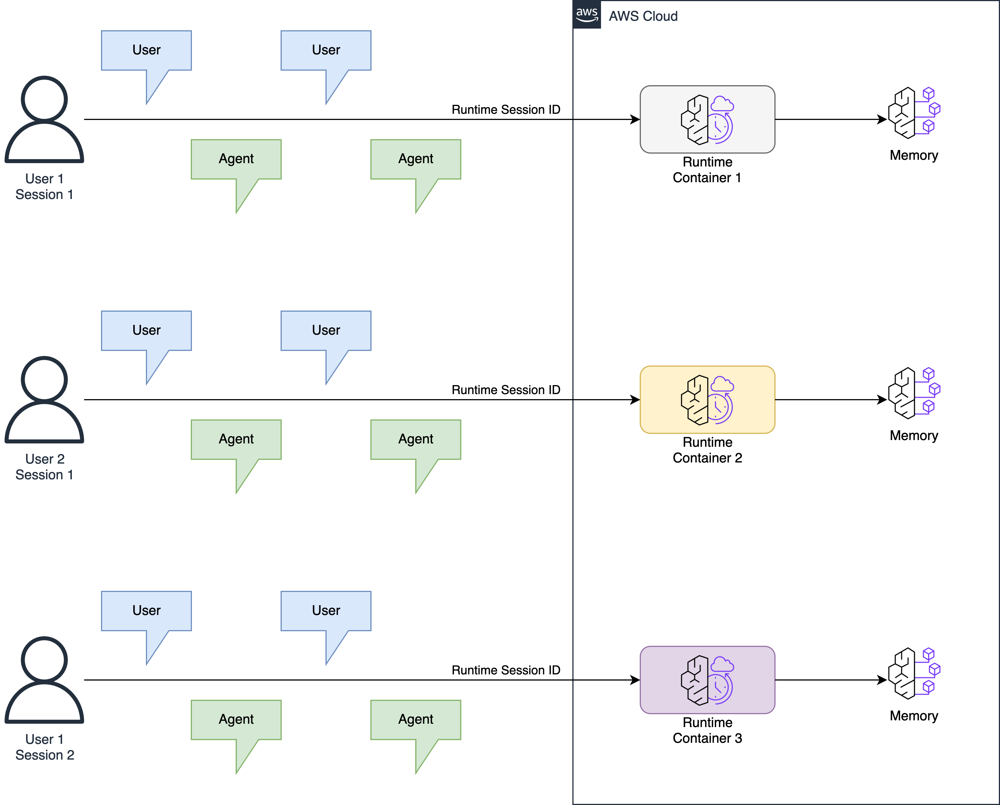
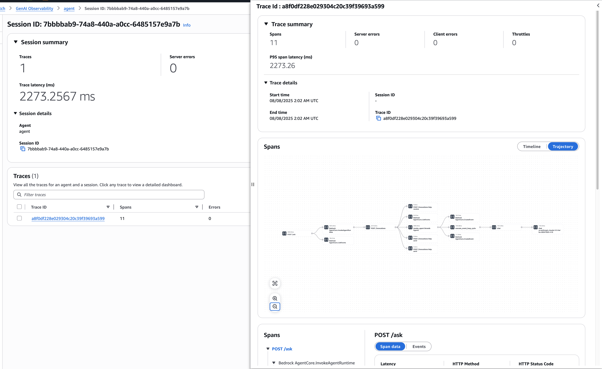
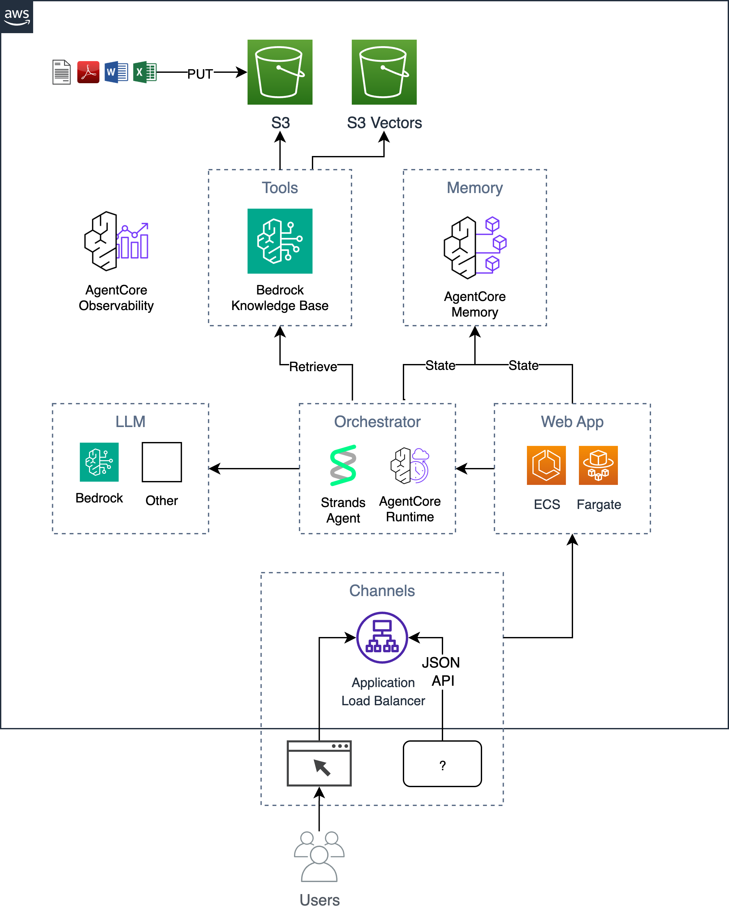

Just a few weeks ago at the AWS Summit in New York on July 16, 2025, AWS announced an exciting new set of services called "[Bedrock AgentCore](https://aws.amazon.com/bedrock/agentcore/)". As I learned how these services work, I built an [AI agent reference implementation](https://github.com/aws-samples/sample-ai-agent-accelerator) using these building blocks that others can easily deploy to AWS and build upon. When deciding what kind of agent to build, I chose to update my older (a year is ancient in AI time 🙂) [AI Chat Accelerator](/posts/enterprise-ai-chatbot-bedrock-kb-postgres-containers/) project using Bedrock AgentCore building blocks.

In this post, I'll discuss some of the services and tools that make up Bedrock AgentCore, how they work, and how I transformed the [AI Chat Accelerator](/posts/enterprise-ai-chatbot-bedrock-kb-postgres-containers/) into the new [AI Agent Accelerator](https://github.com/aws-samples/sample-ai-agent-accelerator).

## What is Bedrock AgentCore?


According to the [docs](https://docs.aws.amazon.com/bedrock-agentcore/latest/devguide/what-is-bedrock-agentcore.html):

> "AgentCore enables developers to accelerate AI agents into production with the scale, reliability, and security, critical to real-world deployment. AgentCore provides services and tools to make agents more effective and capable, purpose-built infrastructure to securely scale agents, and controls to operate trustworthy agents."

Bedrock AgentCore includes these services and tools:

- Runtime
- Memory
- Gateway
- Browser tool
- Code Interpreter tool
- Identity
- Observability

You can read about all of these [here](https://docs.aws.amazon.com/bedrock-agentcore/latest/devguide/), but I'll focus on three: **Runtime**, **Memory**, and **Observability**. Note that these services are in preview status and their capabilities and APIs may change.

### AgentCore Runtime

While we could previously deploy AI agents to AWS compute services like Lambda, EKS, EC2, or ECS (which the AI Chat Accelerator used), AgentCore Runtime offers a container-based compute runtime specifically tailored to hosting AI agents. The key advantages of AgentCore Runtime are true session isolation, built-in identity, and long-running execution.

With AgentCore Runtime, a session ID is included in an HTTP header with each agent invocation, ensuring each session has a dedicated container. A session typically represents a user interacting with the Agent about a specific task. This session isolation makes the programming model easier as the container becomes stateful rather than stateless, while also creating stronger isolation boundaries between user sessions which is crucial when agents handle sensitive information. Figure 1 visualizes this interaction.


<small>Figure 1 - AgentCore runtime session isolation</small>

AgentCore Runtime supports both HTTP API interactions and remote Streamable-HTTP MCP servers. Agents must expose `/invocations` POST and `/ping` GET endpoints and be packaged in a container. All deployed agents require ARM64 architecture. The runtime also integrates directly with AgentCore Identity.

This serverless compute platform differs from traditional AWS Lambda by allowing agents to work on tasks for up to 8 hours versus 15 minutes. This supports AI agents that tackle more complex tasks over longer periods. When an agent goes idle, AgentCore Runtime automatically spins down the container.

### AgentCore Memory

At its core, an AI agent is a code loop that repeatedly invokes an LLM API, building conversation state consisting of user instructions, tool definitions, tool invocations, tool results, and LLM responses. In simple implementations, this state stays in program memory. However, real-world applications typically need to persist this state outside program memory to survive crashes/restarts, enable conversation summarization, store user preferences, and support analytics.

AgentCore Memory provides a straightforward API supporting both short-term and long-term memory. While building your own short-term memory persistence is relatively straightforward, converting memories into long-term memory requires more work. When creating a memory in AgentCore Memory, you specify a `strategy` (options include `user preferences`, `semantic facts`, `summary`, or `custom`), and the service handles the rest, converting short-term memories to long-term memories in the background.

When building with this service, I wanted to see how memories were stored.  I said to myself, "I wish there was an app for that", but now with the use of AI-assisted development tools I said, "let's just make one". I ended up using [Kiro](https://kiro.dev/) to [vibe code](https://en.wikipedia.org/wiki/Vibe_coding) the [AgentCore Memory Explorer](https://github.com/jritsema/agentcore-memory-explorer) tool in a matter of minutes. I simply pointed Kiro at the new [AgentCore Memory boto3 docs](https://boto3.amazonaws.com/v1/documentation/api/latest/reference/services/bedrock-agentcore.html) and told it what I wanted! You can see a screenshot in figure 2 below.


<small>Figure 2 - Screenshot of the vibe coded AgentCore Memory Explorer app</small>

### AgentCore Observability

The final AgentCore feature I'll cover is Observability. The documentation describes it as:

> "Get complete visibility into your GenAI workload's performance with key metrics, end-to-end prompt tracing and step-by-step analysis of LLM interactions. Quickly diagnose issues, gain real-time insights into the performance and reliability of your entire AI stack."

AgentCore Observability appears in the CloudWatch console under "GenAI Observability" and provides a "Bedrock AgentCore" tab with a high-level overview of your agents and drill-down capabilities into:

- Sessions (highest level) - Complete user conversations or interaction contexts
- Traces (middle level) - Individual request-response cycles within a session
- Spans (lowest level) - Specific operations or steps within a trace

To enable this in your agent code, instrument it using the AWS Distro for Open Telemetry (ADOT) SDK:

```
pip install aws-opentelemetry-distro
```

Then set up your Dockerfile to execute your agent code using the OpenTelemetry auto-instrumentation command:

```
CMD ["opentelemetry-instrument", "python", "-u", "main.py"]
```

This provides dozens of runtime, memory, gateway, and tool metrics. If your agent code is also instrumented with OTEL (which [Strands Agents](https://aws.amazon.com) provides), you'll be able to trace an entire agent request from start to finish, understanding exactly what it's doing, how many LLM calls it's making, how long they take, and even drill into the model payloads.


<small>Figure 3 - GenAI Observability showing a user/agent interaction trace</small>

## AI Chat Accelerator vs AI Agent Accelerator

Now I'll explain how I'm using these AgentCore services in the new AI Agent Accelerator project. The [AI Chat Accelerator](https://github.com/aws-samples/ai-chat-accelerator) (described in detail [here](https://community.aws/content/2lCaIftOHliEE7Hhzg3cc7N021J)) is a web chatbot where users ask questions and receive answers based on documents stored in an S3 bucket. When building the new [AI Agent Accelerator](https://github.com/aws-samples/sample-ai-agent-accelerator), I wanted to provide the same capabilities but use the latest AWS services. Here's the new reference implementation:


<small>Figure 4 - AI Agent Accelerator</small>

The key differences between the two architectures are:

- 100% session isolation for user/AI interactions
- Managed agent memory conversation state
- Agentic vs traditional Retrieval Augmented Generation (RAG)
- Truly serverless vector storage
- Built-in Observability

#### 100% session isolation for user/AI interactions

In AI Chat Accelerator, a local Python function communicated directly with the [Bedrock Converse API](https://docs.aws.amazon.com/bedrock/latest/APIReference/API_runtime_Converse.html), managing memory and making LLM calls. This code ran in an HTTP server packaged in a container on Fargate behind an ALB, with one container serving multiple users concurrently.

In AI Agent Accelerator, I've moved the orchestrator code into an AgentCore Runtime container, providing a separate container for each user session.

#### Managed agent memory conversation state

AI Chat Accelerator managed its short-term memory by building a JSON payload and persisting it to a Postgres database table. Since the orchestrator ran in a stateless Fargate container serving many users, it had to re-fetch conversation state on each user interaction, which could be slow. When showing users past chats, the code would display only the first question from each conversation.

AI Agent Accelerator uses the AgentCore Memory API to fetch sessions representing conversations, eliminating the need to manage a Postgres table. It also supports AgentCore Memory's ability to automatically summarize a session for chat history. We can extract user preferences and key insights for future agent interactions to personalize the agent (not yet implemented).

The following code snippet shows the implementation of the agent's `POST /invocations` endpoint using FastAPI. Agents can use any programming language, but Python users can also use the higher-level [Bedrock-agentcore SDK](https://github.com/aws/bedrock-agentcore-sdk-python). The code initializes the Strands agent once per container and uses a `MemoryHookProvider` to persist conversation state to AgentCore Memory and reload it. During initialization, nothing happens here, but if AgentCore Runtime spins down the container due to inactivity, conversation state will be restored from AgentCore Memory when the session resumes.

```python
# we have a single stateful agent per container session id
strands_agent = None

@app.post("/invocations", response_model=InvocationResponse)
async def invoke_agent(request: Request):
    global strands_agent
    try:
        req = await request.json()
        invoke_input = req["input"]
        prompt = invoke_input["prompt"]
        user_id = invoke_input["user_id"]
        session_id = request.headers.get("X-Amzn-Bedrock-AgentCore-Runtime-Session-Id")

        if strands_agent is None:
            logging.warning("agent initializing")

            # initialize a new agent once for each runtime container session
            # conversation state will be persisted in both local memory
            # and remote agentcore memory. for resumed sessions, it will be
            # reloaded from agentcore memory
            strands_agent = Agent(
                model="us.anthropic.claude-sonnet-4-20250514-v1:0",
                system_prompt=system_prompt,
                tools=[retrieve],
                hooks=[MemoryHookProvider(
                    memory_client,
                    memory_id,
                    user_id,
                    session_id
                )],
            )

        # invoke the agent
        result = strands_agent(prompt=prompt)

        # send response to client
        response = {
            "message": result.message,
            "timestamp": datetime.utcnow().isoformat(),
            "model": "strands-agent",
        }
        return InvocationResponse(output=response)

    except Exception as e:
        raise HTTPException(
            status_code=500, detail=f"Agent processing failed: {str(e)}")
```
<small>Figure 5 - AgentCore Runtime python code showing agent initialization</small>

#### Agentic vs traditional RAG

In AI Chat Accelerator, the agent performed traditional Retrieval Augmented Generation (RAG): taking the user's question, searching the knowledge base for matching document chunks based on semantic meaning, and injecting them into the LLM prompt. For follow-up questions, the agent would make an LLM call to convert the question to a new search query with proper context, then repeat the RAG process.

In AI Agent Accelerator, I implemented "Agentic RAG," which uses [LLM tool calling](https://docs.aws.amazon.com/bedrock/latest/userguide/tool-use-inference-call.html) where "knowledge base search" becomes a tool available to the LLM. The Strands Agent SDK includes a built-in `retrieve` tool that the LLM can use to search the knowledge base, making it easy to add additional tools. In Figure 4, you can see where we load the `retrieve` tool, which can be imported with:

```python
from strands_tools import retrieve
```

Tools can be local Python functions, MCP servers, or even REST APIs and Lambda functions when using [AgentCore Gateway](https://docs.aws.amazon.com/bedrock-agentcore/latest/devguide/gateway.html).

#### Truly serverless vector storage

AI Chat Accelerator used Bedrock Knowledge Bases with an Aurora Postgres backend (pgvector) to persist and query document chunk vectors.

AI Agent Accelerator uses the new [S3 Vectors](https://docs.aws.amazon.com/AmazonS3/latest/userguide/s3-vectors.html) capability with Bedrock Knowledge Bases instead of Aurora Postgres. The semantic search works similarly, but S3 Vectors eliminates the need for an always-on database. S3 Vectors offers lower TCO, better scaling with vast amounts of S3 storage, and direct integration with Amazon OpenSearch Service for performance fine-tuning.

#### Built-in Observability

AI Chat Accelerator had strong observability through AWS X-Ray integration. It used OTEL auto-instrumentation for both Boto3 and the Postgres client to trace web requests back to LLM calls and AWS services.

AgentCore Runtime and AgentCore Memory provide additional traces and metrics for understanding code paths at a user session level, allowing us to drill into specific sessions which is something we couldn't do before.

## Conclusion

In this post, I explained the recently announced Bedrock AgentCore services and tools, focused on three key components, and showed how I used them to build the [AI Agent Accelerator](https://github.com/aws-samples/sample-ai-agent-accelerator) reference implementation.

To try out the AI Agent Accelerator yourself, follow the detailed instructions in the [README.md in the GitHub repository](https://github.com/aws-samples/sample-ai-agent-accelerator?tab=readme-ov-file#1-setupinstall-prerequisites).

I hope this post helps you understand how to build AI agents on AWS and the benefits of these new building blocks. Happy building!
