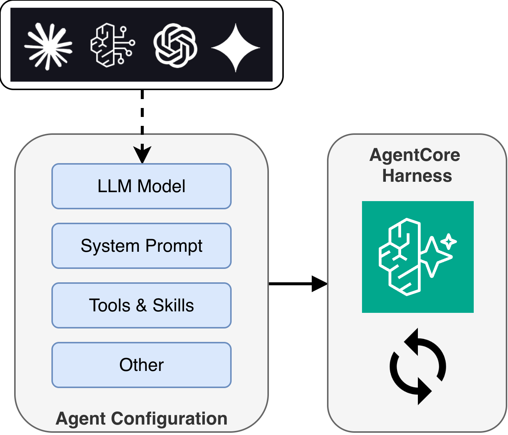
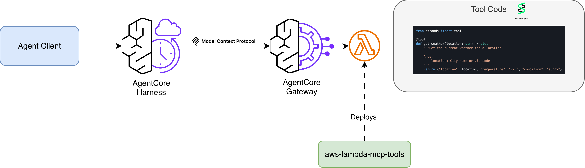
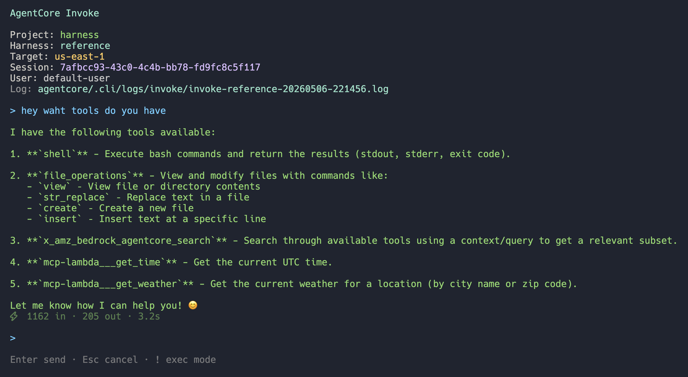
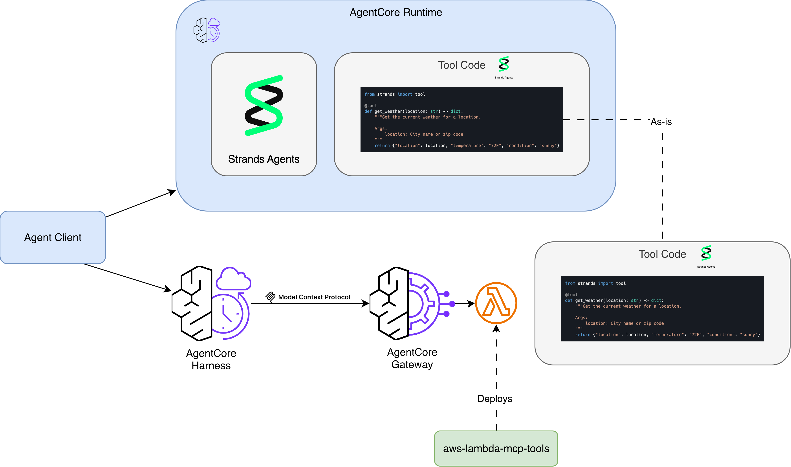

I built [aws-lambda-mcp-tools](https://github.com/jritsema/aws-lambda-mcp-tools), a template that turns a decorated Python function into a deployed [AgentCore Gateway](https://docs.aws.amazon.com/bedrock-agentcore/latest/devguide/gateway.html) tool in one command. Write a function, run `make deploy`, and your tool is live and callable by any agent connected to that gateway. Here's the context for why that's useful.

## AgentCore Harness: A Managed Agent Loop

AWS just launched [AgentCore Harness](https://docs.aws.amazon.com/bedrock-agentcore/latest/devguide/harness.html) - a managed agent loop within [Amazon Bedrock AgentCore](https://aws.amazon.com/bedrock/agentcore/). This is exciting because, for many use cases, it means developers no longer need to own the orchestration code that drives an agent's LLM inference loop.

With Harness, you declare a configuration specifying which model your agent uses, what instructions it follows, and which tools it can call. AgentCore provisions the full runtime environment from that config: compute (session-isolated microVMs), memory (short-term and long-term), identity, observability, and networking. Changing models or adding tools is a config change, not a code rewrite.



Previously, teams building on AgentCore would deploy a container (or zip) with a custom agent framework like [Strands Agents](https://strandsagents.com/) or [LangGraph](https://www.langchain.com/langgraph), owning the full agent loop themselves. Harness takes that responsibility off your plate and lets you focus on what makes your agent unique: its tools and instructions.

## AgentCore Gateway: Connecting Agents to Tools

So where do tools live? That's where [AgentCore Gateway](https://docs.aws.amazon.com/bedrock-agentcore/latest/devguide/gateway.html) comes in. Gateway is the tool connectivity layer that exposes your tools to agents via the [Model Context Protocol (MCP)](https://modelcontextprotocol.io/).

Gateway provides more than just connectivity:

- **Policy enforcement** - [AgentCore Policy](https://docs.aws.amazon.com/bedrock-agentcore/latest/devguide/policy.html) integration that uses [Cedar](https://www.cedarpolicy.com/)-based authorization to control which users and agents can call which tools, evaluated on every request
- **Managed authentication** - handles both ingress (verifying agent identity) and egress (injecting credentials, refreshing OAuth tokens)
- **Semantic tool selection** - agents can search across large tool collections to find the right tool for their task, rather than relying on a static list

For custom tools, Lambda is a natural fit as a Gateway target: serverless, scalable, pay-per-invocation. But there are several steps involved in getting a Lambda function registered and working with Gateway: authoring a JSON schema, uploading it to S3, creating the Lambda with the right IAM role, adding resource-based policies for Gateway to invoke it, and registering it as a target. When you update your tool's parameters, you need to regenerate the schema, re-upload, and update the target.

I wanted a faster iteration loop.

## The Solution: aws-lambda-mcp-tools

I built [aws-lambda-mcp-tools](https://github.com/jritsema/aws-lambda-mcp-tools) to streamline this workflow. The idea is simple: you write a decorated Python function, and the tooling handles the rest.

### Define a tool

Edit `tools.py` and add a function with the `@tool` decorator:

```python
from strands import tool

@tool
def get_weather(location: str) -> dict:
    """Get the current weather for a location.

    Args:
        location: City name or zip code
    """
    return {"location": location, "temperature": "72F", "condition": "sunny"}
```

The tool name, description, parameter types, and parameter descriptions are all inferred from your function signature and docstring. No separate schema file to maintain.

### Create

The first time you deploy, use `make create`. This provisions everything from scratch: the Lambda function, IAM role, S3 schema, invoke permissions, and Gateway target registration.

```sh
make create function=my-tools gateway_id=gw-abc123
```

### Deploy

After making code changes, use `make deploy`. This rebuilds the Lambda, regenerates the schema, re-uploads to S3, and updates the Gateway target - all in one command.

```sh
make deploy function=my-tools gateway_id=gw-abc123
```

### Test

You can invoke a specific tool directly on the deployed Lambda:

```sh
# edit request.json with your tool's input, then:
make invoke function=my-tools tool=get_weather
```

Or test locally without deploying:

```sh
make start
```

## How It Works

The project has a simple architecture:

**At build time**, `generate_schema.py` introspects your `@tool` decorated functions and exports a `tools.json` file with the MCP-compatible schema. The Makefile uploads this to S3 where Gateway reads it.

**At runtime**, when an agent calls a tool through Gateway, the Lambda receives the invocation with context identifying which tool was called. `lambda_function.py` extracts the tool name from the AgentCore context and routes to the correct handler:

```python
def lambda_handler(event, context):
    custom = context.client_context.custom
    raw_tool_name = custom["bedrockAgentCoreToolName"]
    tool_name = raw_tool_name[raw_tool_name.index("___") + 3:]

    handler = get_handler(tool_name)
    result = handler(**event)
    return result
```

A single Lambda can handle multiple tools, routed by name. You add tools by adding functions to `tools.py` - the registry auto-discovers them.

## Putting It All Together



With Harness managing your agent loop and Gateway connecting your agent to tools, this template gives you a fast path to populate Gateway with custom Lambda-based tools. Use the [AgentCore CLI](https://docs.aws.amazon.com/bedrock-agentcore/latest/devguide/harness-get-started.html) to scaffold your agent with a Harness and Gateway, write your tools in `tools.py`, and run `make create` to deploy them. The two tools pair well together for prototyping and getting agents running quickly.

Your agent is now running with custom tools, and you haven't written any orchestration code or MCP protocol handling. Of course, there are times when you need full control over the agent loop, and for that, you can deploy directly to AgentCore Runtime with a framework like Strands. But for many use cases, it's nice to have the option of building something useful without the ongoing care and feeding of boilerplate code.

To test your agent, you can use the AgentCore CLI's TUI to invoke the deployed agent (`agentcore invoke`) - here you can see it has access to the tools we deployed via `make create`:



## Migrating Runtime Inline Tools to Gateway



The template uses the same [`@tool` decorator from Strands Agents](https://strandsagents.com/docs/user-guide/concepts/tools/). If you already have tools running in-process on a Strands agent deployed to AgentCore Runtime, you can copy those functions directly into this project - same decorator, same docstring format, same code. No rewriting required.

This makes it straightforward to take existing tool code and deploy it behind Gateway, giving you the benefits of auth, policy enforcement, semantic search, and managed auth without changing your tool implementations.

## Getting Started

You'll need AWS credentials configured with permissions to create Lambda functions, IAM roles, S3 buckets, and AgentCore Gateway targets.

The project is on GitHub: [aws-lambda-mcp-tools](https://github.com/jritsema/aws-lambda-mcp-tools)

```sh
git clone https://github.com/jritsema/aws-lambda-mcp-tools
cd aws-lambda-mcp-tools
make init && make install

# Edit tools.py with your tools, then:
make create function=my-tools gateway_id=<your-gateway-id>
```

It supports both container and zip packaging, arm64 and x86_64 architectures, and includes local testing via `make start`. The [README](https://github.com/jritsema/aws-lambda-mcp-tools) has the full Makefile reference and configuration options.

If you're exploring AgentCore and want a fast way to get custom tools into Gateway, give it a try. I'd love to hear your feedback on the [GitHub repo](https://github.com/jritsema/aws-lambda-mcp-tools).
