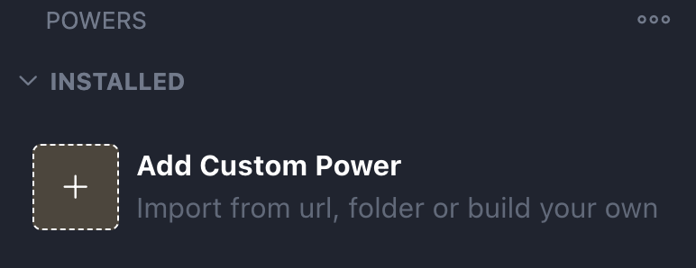
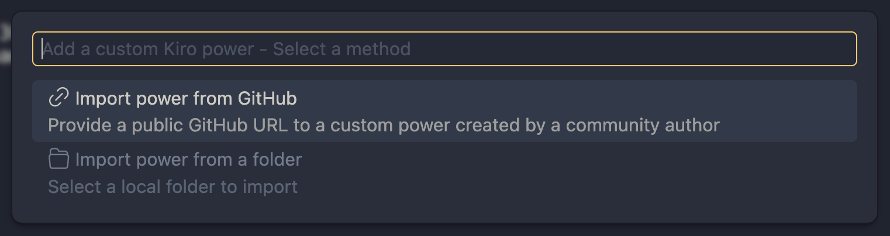
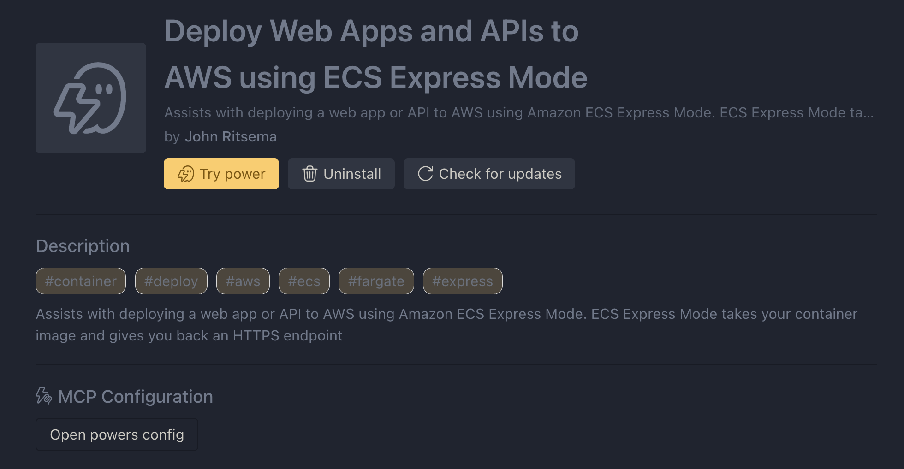
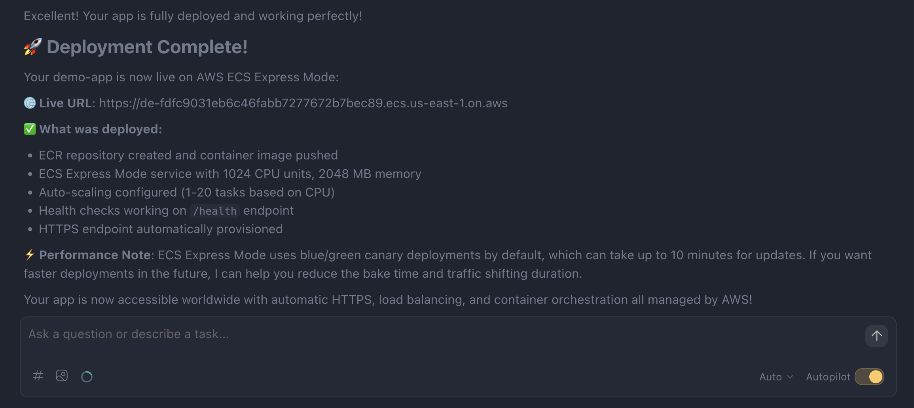

## Why I Keep Rebuilding Deployment Tools

I've been building various [deployment tools and CLIs](/projects) for years. When [AWS Fargate](https://aws.amazon.com/fargate/) launched at [re:Invent 2017](https://www.youtube.com/watch?v=0SceSgOTyrw), I built [tools](https://github.com/turnerlabs/fargate-create) to help our enterprise adopt it. They worked great... for a while. But like every deployment tool, they became brittle, hard to maintain, and frustrating for new team members to learn. This post is about a different approach.

## The Unix Philosophy

[Unix gave us small, composable tools](https://en.wikipedia.org/wiki/Unix_philosophy) that let operators assemble powerful workflows. This is a beautiful concept, but the flexibility comes at a cost: having to understand and configure many tools.

Deploying a containerized app means orchestrating a whole toolchain:

- Docker CLI (login, build, tag, push)
- AWS CLI or SDK (ECR, ECS, IAM, ELB)
- Maybe Docker Compose for local testing
- Maybe Terraform or CDK for infrastructure

Each tool has its own installation process, configuration quirks (credentials, profiles, regions), version compatibility issues, and flag syntax to memorize. You're not just learning one CLI, you're learning how to glue a dozen together. And when something breaks, developers struggle to figure out which tool in the chain failed and why.

## Scripts: Duct Tape and Bubble Gum

Bash scripts, Makefiles, custom CLIs that orchestrate the tool chain. They encode tribal knowledge: "run this before that, set this env var, wait for this condition."

They work... until they don't:

- An assumption changes (new AWS region, different IAM setup)
- A tool updates and breaks compatibility
- Someone new joins and doesn't have the right versions installed

These scripts are brittle, prescriptive, and context-blind. They don't know your app, your intent, or what went wrong.

## "Just Use AI to Generate a Better Script"

Yes, you can now prompt an LLM to write a deployment script in minutes. But you still get a procedural artifact that:

- Can't adapt when things go wrong
- Doesn't help you debug tool installation issues
- Requires _you_ to understand it when it fails

The script is smarter, but the paradigm hasn't changed much.

## The Agentic Alternative

What if the AI _is_ the deployment tool?

Instead of generating a script, the agent:

- Inspects your codebase to infer configuration (port, health check, environment variables)
- Asks clarifying questions when things are ambiguous
- Calls APIs directly: no CLI installation required
- Monitors progress and reacts to failures
- Helps you fix your environment: missing credentials? Docker not running? The agent can diagnose and guide you through it

This approach is more flexible. It handles edge cases, adapts to your situation, and explains what it's doing along the way.

### Tradeoffs

| Procedural CLI    | Agentic Deployment     |
| ----------------- | ---------------------- |
| Deterministic     | Non-deterministic      |
| Fails cryptically | Explains and recovers  |
| Fast execution    | Slower, conversational |
| Fixed workflow    | Adapts to context      |
| Free after build  | Token costs per run    |
| You debug alone   | Agent debugs with you  |

Let's be real about the downsides:

- **Cost**: every deployment burns tokens: fine for development, worth considering at scale
- **Non-determinism**: the agent can take different paths each time
- **Potential incorrectness**: LLMs can hallucinate; guidance and human confirmation matter

But for complex, infrequent, or novel deployments, the flexibility often wins.

## Agents: Providing Guidance and Teaching New Skills

Agents need guidance and the ability to learn new skills. The challenge is how to give them that knowledge without overwhelming them. If you stuff everything into an agent's context window (every tool, every workflow, every edge case), the agent gets confused, forgets instructions, and makes mistakes. We call this **"context rot"**.

One solution is **progressive disclosure**: load knowledge on-demand when it's relevant to the conversation. [Anthropic](https://www.anthropic.com/) has pioneered a new proposed standard to address this called [Agent Skills](https://agentskills.io/). Skills are markdown files that contain metadata and instructions and can optionally contain documentation, templates, resources, and scripts. The idea is that an agent pre-loads only metadata about a skill, and then when a task matches a skill’s description, the agent reads the full `SKILL.md` instructions into context. From there, the agent follows the instructions, optionally loading referenced files or executing bundled code as needed.

## Kiro Powers

At AWS re:Invent 2025, [Kiro announced Powers](https://kiro.dev/blog/introducing-powers/). Powers are similar to Agent Skills, but also function as a packaging and distribution mechanism like [Claude Plugins](https://code.claude.com/docs/en/plugins) that can include things like [MCP server configurations](https://kiro.dev/docs/powers/create/#adding-mcp-servers).

Every power has a **POWER.md** (similar to **SKILL.md**) file which contains metadata + human readable instructions. A power can optionally include:

- **steering/** - Workflow-specific guidance files
- **mcp.json** - MCP server configuration for tool integrations

When you mention a relevant keyword in conversation, Kiro dynamically loads the appropriate power. The agent gets both the knowledge and the capabilities it needs in one package.

## AWS ECS Express Mode

Also [announced at re:Invent 2025](https://www.youtube.com/watch?v=TllCWtY7zRc), [ECS Express Mode](https://docs.aws.amazon.com/AmazonECS/latest/developerguide/express-service-overview.html) is a higher-level API abstraction for running containerized apps and APIs on AWS.

The pitch: _"Give me a container image, I'll give you an HTTPS endpoint."_

Under the hood, it provisions everything you'd normally configure manually: VPC networking, Application Load Balancer, ECS cluster, Fargate tasks, IAM roles, health checks, and auto-scaling. You don't have to wire up each piece, just specify your image, port, and basic settings.

It's great for web apps and APIs where you want to skip the infrastructure plumbing. But you still need to know the right API calls, the IAM role setup, and the deployment workflow. Since it's newly released, the current generation of models have not been trained on it. That's where the Kiro Power comes in.

## ECS Express Power

I built an experimental [Kiro Power](https://kiro.dev/powers/) for ECS Express deployments. The structure is simple:

```sh
power/
├── POWER.md    # Deployment workflow, questions to ask, guidelines
└── mcp.json    # AWS API MCP server configuration
```

The [POWER.md](https://github.com/jritsema/ecs-express-power/blob/main/power/POWER.md) file encodes everything the agent needs to know: how to infer app config from your codebase, what questions to ask, which IAM roles to create, which ECS Express APIs to use (not the traditional ECS APIs), how to monitor the deployment, and how to clean up.

The [mcp.json](https://github.com/jritsema/ecs-express-power/blob/main/power/mcp.json) configures the [AWS API MCP server](https://awslabs.github.io/mcp/servers/aws-api-mcp-server), which calls AWS APIs directly. **No AWS CLI installation required.** You still need local AWS credentials (via a profile or environment variables), but that's it.

The power is open source: [github.com/jritsema/ecs-express-power](https://github.com/jritsema/ecs-express-power)

## The Experience

Here's what it looks like in practice:

```
You: "deploy my app to ecs express"

Kiro: [loads power dynamically]
      "I scanned your codebase and found your app listens on port 3000
       with a /health endpoint. I'll use 'my-app' as the service name
       and go with the default cpu and memory. Sound good?"

You: "yes, but I want 2 vCPUs and 4GB memory"

Kiro: "Got it. I'll create an ECR repository and push your image.
       Do you have any environment variables to include?"

You: "DATABASE_URL from my .env file"

Kiro: [creates IAM roles if they don't exist]
      [builds linux/amd64 image]
      [pushes to ECR]
      [packages container configuration]
      [calls create-express-gateway-service API]
      [monitors deployment, checking every 60 seconds]

      "Deployment complete. Your endpoint is:
       https://my-app-abc123.us-east-1.amazonaws.com

       Health check passed. ✓"
```

The conversation is adaptive. Already have an ECR image? Skip the build. Docker not running? The agent tells you and starts it if needed. Credentials expired? It helps you fix that too.

## Pondering the Future

Does this replace Infrastructure as Code? Not for production workloads... yet. [Terraform](https://developer.hashicorp.com/terraform), [CDK](https://aws.amazon.com/cdk/), and similar tools still win when you need repeatable, auditable, version-controlled infrastructure.

But it complements IaC:

- **Prototyping and experimentation** - get something running fast without writing config files
- **Onboarding** - new developers can deploy without learning the entire toolchain
- **Troubleshooting** - when deployments fail, the agent can help diagnose and fix

Some things I'm pondering:

- **Composability**: What happens when agents can chain powers together? Deploy → monitor → alert → rollback as one conversation?
- **Auditability**: Can conversation logs serve as deployment history?
- **Shifting tradeoffs**: Token costs are dropping, models are getting more reliable. The calculus is changing.
- **Migrating to IaC**: What if after deploying you could then say, "now build me a CDK program that does exactly what you have done in this workflow"?

We're early in this paradigm shift. The procedural CLI isn't going away, but for a growing set of use cases, talking to an agent is a better experience.

## Try It

There's a new Powers icon on the activity bar. In the top "Installed" section, there's a new "Add Custom Power" button.





When you click the button, you'll be prompted to enter a URL. Use this:

```
https://github.com/jritsema/ecs-express-power/tree/main/power
```



Now you're ready to use the power. Open a project that has source code for a web app or API and a Dockerfile (or use the agent to generate these). Just start a new Kiro session and enter:

_"deploy my app to ecs express"_

When the deployment is complete, you should see something like this:



If you try it out, I'd love to hear how it goes, especially the edge cases where it breaks. Open an [issue](https://github.com/jritsema/ecs-express-power/issues) on the [GitHub repo](https://github.com/jritsema/ecs-express-power).
