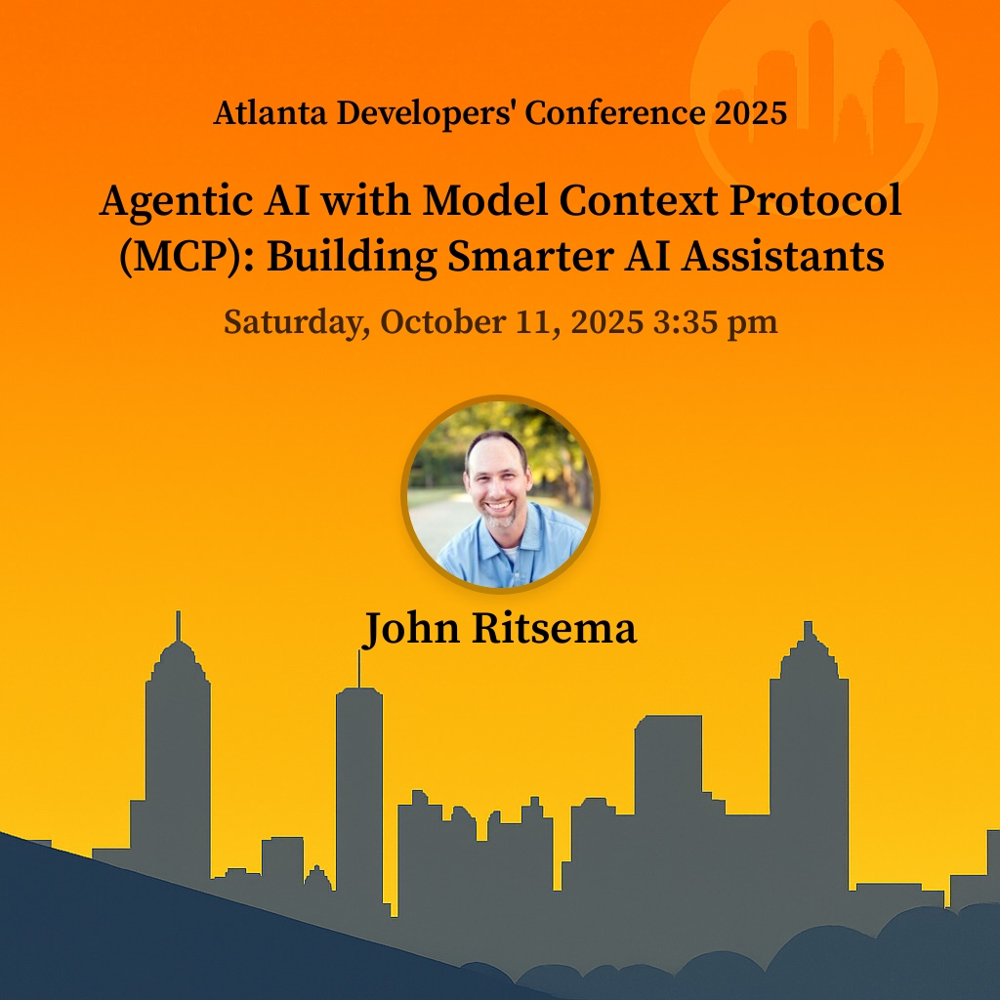

I'm excited to be speaking at the [Atlanta Developers' Conference](https://www.atldevcon.com/) on October 11th, 2025! My session is entitled, **"Agentic AI with Model Context Protocol (MCP): Building Smarter AI Assistants"**.

I'm particularly passionate about this topic because MCP isn't just awesome technology - it's become an integral part of my daily workflow. As an AWS Solutions Architect, I use MCP-powered AI assistants for everything from writing code to conducting research and technical writing. The protocol has genuinely transformed how I work with AI tools.

Here's the talk description:

Large Language Models are incredibly powerful, but they're fundamentally limited by their training data cutoff dates and lack of access to real-time information. While RAG (Retrieval-Augmented Generation) helps inject static context, modern AI assistants need something more dynamic - the ability to interact with live systems, APIs, and data sources in real-time.

Enter the Model Context Protocol (MCP), an open standard that's revolutionizing how AI agents connect to external tools and data sources. MCP provides a unified protocol that eliminates tight coupling and enables seamless interoperability.

**What You'll Learn:**

- **MCP Architecture Deep Dive**: Explore the building blocks - MCP hosts, clients, servers, and transport mechanisms (stdio and streamable http)
- **Protocol Capabilities**: Learn how MCP servers expose tools, resources, and reusable prompts to AI agents
- **Server Development**: Walk through an example MCP server for AWS Lambda operations using official SDKs, including tools for listing functions, updating runtime versions, and safe deployment practices
- **AWS Native Solutions**: Discuss options for running your MCP servers on AWS including the newly announced Amazon Bedrock AgentCore services and how they enable scalable MCP and agent deployments

Walk away with practical knowledge and code samples to start building your own MCP servers and creating more capable, context-aware AI assistants.

You can checkout the [conference website](https://www.atldevcon.com/) to see the [schedule](https://www.atldevcon.com/schedule) along with the list of [sessions](https://www.atldevcon.com/sessions) and [speakers](https://www.atldevcon.com/speakers).

Hope to see you there! I'll be around for questions after the session and would love to connect with fellow developers interested in Agentic AI and MCP.
